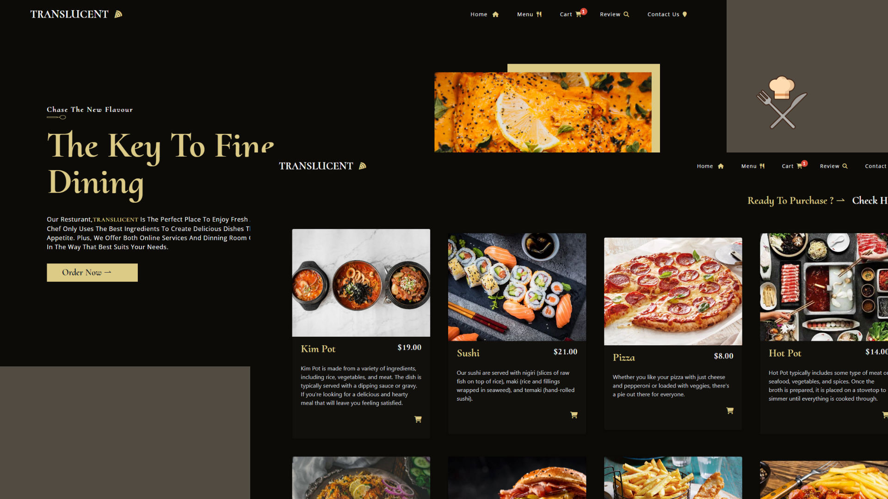

<div align="center">
  
</div>
<h1 align="center">
    Translucent Food eCommerce Web App   v-1
</h1>
<p align="center">
  The first iteration of <a href="https://trlc.netlify.app/" target="_blank"> Translucent eCommerce Website </a> built with <a href="https://reactjs.org/" target="_blank"> React </a> and hosted with <a href="https://www.netlify.com/" target="_blank">Netlify</a>
</p>
<br />

### Click to <a href="https://vbra.netlify.app/" target="_blank"> Visit </a>
<br />
 <a href="https://trlc.netlify.app/" target="_blank">
    
  </a>
  
  <br />
<br />
  <br />
<br />

> The app is designed to streamline the process of selling food from a restaurant by simplifying the ordering and delivery process.

  <br />


## Built with

```bash

 React

 TailwindCSS

 Styled-components
 
 CommereceJS
 
```

  <br />

## Used

```bash
 Vite       React-Router-Dom        Framer motion
```

  <br />

### Color Reference

| Color        | Hex       |
| ------------ | --------- |
| Coffee Black | `#0C0B08` |
| Light Yellow | `#DCCA87` |

<br />

### Fonts

```bash
  Cormorant Upright
  Open San
  Montserrat Alternates
```

<br />


## About
 > **Include the ability to be responsive to all screen sizes.** <br>
 > **Having a user-friendly interface.** <br>
 > **Providing a secure checkout process.** <br>
 > **Provided customer reviews page.**  <br>
 > **Cart data advanced management with secure API.** <br>
 > **Used React Context to stop props drilling and increase web performance.**
 
<br />
<br />
 
 
 <div align="center">
  
  <h6> Designed & Built By <a href="https://github.com/sumyat-aung/">Su Myat Aung</a></h1>
</div>


